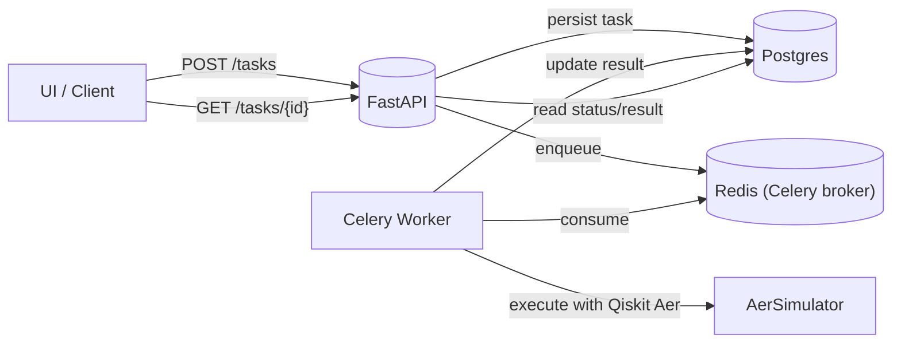
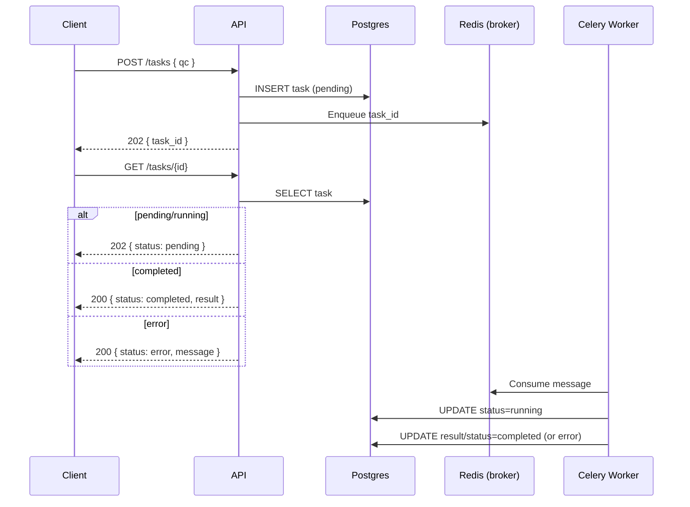

# Quantum Task API

Asynchronous API to submit and execute Quantum Circuits (QASM3) using Qiskit. It provides:
- POST `/tasks` to submit a circuit
- GET `/tasks/{id}` to poll status/result
- Web UI at `/ui` to paste QASM3 and run interactively

## Tech stack
- FastAPI (API)
- Celery + Redis (async workers & broker)
- Postgres (task store)
- Qiskit + AerSimulator (execution)
- Docker Compose (orchestration)

## Quick start

Prereqs: Docker Desktop running.

```bash
# from repo root
docker compose build
docker compose up -d
# check health
curl http://localhost:8000/healthz
```

Open the UI: http://localhost:8000/ui

### Demo video

[Watch the demo video](https://akashkthkr.github.io/quantum_task_classiq/ClassiqDemoVideo.mp4)

### Admin UI

- I open the admin page at: http://localhost:8000/admin
- Password: `classiq` (or pass via header `x-admin-password: classiq`)
- Features:
  - I can list submitted tasks with status and timestamps
  - I can toggle auto‑refresh (every ~2s) or click manual refresh
  - I can view JSON result inline for completed tasks
  - I can download submitted QASM (`.qasm`)
  - I can open a circuit visualization (PNG) for non‑error tasks

Admin API (JSON):

```bash
curl -s "http://localhost:8000/admin/tasks?password=classiq" | jq
# Download QASM for a task
curl -s -H 'x-admin-password: classiq' -OJ http://localhost:8000/admin/tasks/<TASK_ID>/qasm3
```

## Submit the example circuit (CLI)

I ship an example QASM3 at `examples/basic.qasm3`.

```bash
QASM=$(tr -d '\n' < examples/basic.qasm3 | sed 's/"/\\"/g')
# submit
curl -s -X POST http://localhost:8000/tasks \
  -H 'content-type: application/json' \
  --data-binary "{\"qc\": \"$QASM\"}"
# => {"task_id":"<uuid>","message":"Task submitted successfully."}

# poll
ID=<paste-task-id>
curl -s http://localhost:8000/tasks/$ID
```

## Testing

See the detailed test guide in [tests/README.md](tests/README.md).

I also run the full test suite on each PR in CI. You can view the job logs in the "Actions" tab to make sure everything is green before merging.

### Live preview (temporary URL)

I can spin up a temporary public URL for the API/UI using the GitHub Actions workflow:

- Go to GitHub → Actions → run the manual workflow named "Live UI Preview".
- It builds the stack and starts a Cloudflare tunnel. The job summary prints a "Preview URL" plus handy links to `/ui` and the Admin UI.
- The tunnel stays up for ~20 minutes and then shuts down automatically.

## Endpoints
- POST `/tasks`
  - body: `{ "qc": "<QASM3 string>" }`
  - 202: `{ "task_id": "<uuid>", "message": "Task submitted successfully." }`
- GET `/tasks/{id}`
  - completed 200: `{ "status": "completed", "result": {"0": 512, "1": 512} }`
  - pending 202: `{ "status": "pending", "message": "Task is still in progress." }`
  - not found 404: `{ "status": "error", "message": "Task not found." }`

## Environment
Defaults are embedded in `docker-compose.yml`. If you need overrides, export env vars before `docker compose up`:
- `POSTGRES_*`, `REDIS_URL`, `CELERY_*`, `NUM_SHOTS` (default 1024)

## Local dev without Docker (optional)
```bash
python3 -m venv .venv && source .venv/bin/activate
pip install -r requirements.txt
export POSTGRES_HOST=localhost REDIS_URL=redis://localhost:6379/0 \
       CELERY_BROKER_URL=$REDIS_URL CELERY_RESULT_BACKEND=$REDIS_URL
# run API
uvicorn app.main:app --reload
# run worker (new shell)
celery -A app.celery_app.celery worker -l info
```

## Troubleshooting
- API not responding: `docker compose logs api | tail -n 200`
- Worker errors: `docker compose logs worker | tail -n 200`
- Rebuild after code changes: `docker compose build && docker compose up -d`

## Project layout
- `app/` – API, Celery worker, DB models, quantum helpers
- `app/static/` – UI served at `/ui`
- `examples/` – sample QASM3
- `docker-compose.yml`, `Dockerfile.api`, `Dockerfile.worker`


## License
MIT (exercise code).

## Architecture (overview)

Flow: API → DB → Celery/Redis → Worker → DB → API/UI

- I persist a new `Task` row in Postgres (status `pending`) before enqueueing the job to Celery (Redis broker). This guarantees task integrity: if the broker is unavailable, the DB row still exists and the API returns an error instead of silently dropping the task.
- A Celery worker consumes messages, loads the QASM3 circuit, and runs it on `AerSimulator`. Results (or errors) are written back to the same `Task` row. I configure `task_acks_late=True` and `worker_prefetch_multiplier=1` to avoid losing in-flight tasks if a worker crashes.
- The GET endpoint reads the task state from Postgres and returns:
  - 200 for `completed` (with result),
  - 202 for `pending`/`running`,
  - 404 for not found,
  - 200 with `{status:"error"}` for tasks in an error state (with message).
- Docker Compose orchestrates Postgres, Redis, the API container and the worker container, so everything is reproducible and isolated.

Indexes

- A composite index `(status, submitted_at)` is added on `tasks` to keep status queries and admin listings efficient as volume grows.

## Architecture diagram

The high-level component interactions are shown below. GitHub renders Mermaid diagrams directly.



And the submit/poll sequence:



## Next steps (roadmap)

- Caching of identical circuits: I can hash the QASM3 payload (e.g., SHA-256) and cache completed results in Postgres or Redis. On submit, I would first look up the hash; if present and still valid, I would return the existing `task_id` or even short‑circuit with a fresh `task_id` that immediately points to the cached result. This avoids re-running identical workloads.
- User management and data scoping: I can attach an authenticated `user_id` to each task (JWT or session), store it in the `tasks` table, and enforce `GET /tasks/{id}` access only for owners (and optionally admins). I can also add a "list my tasks" endpoint to filter by `user_id`. For sharing, I can keep task‑ID lookups but gate them behind a share token or a flag at submission time.
